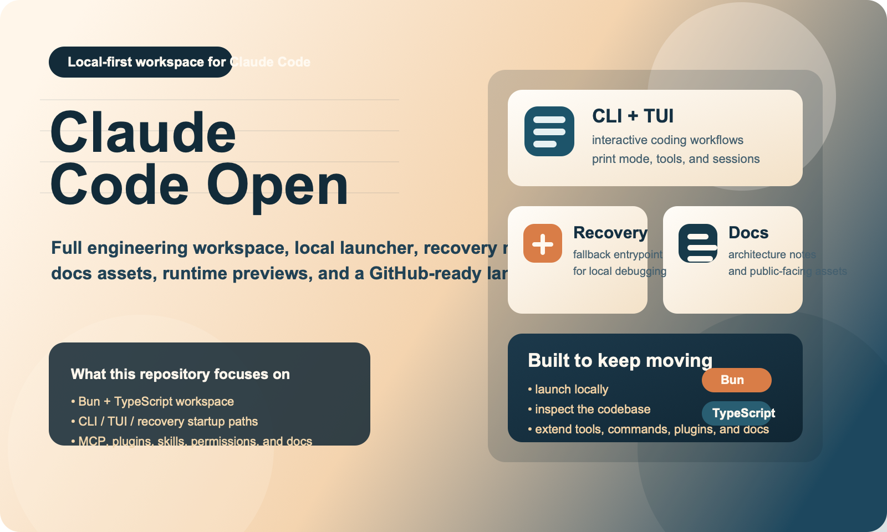
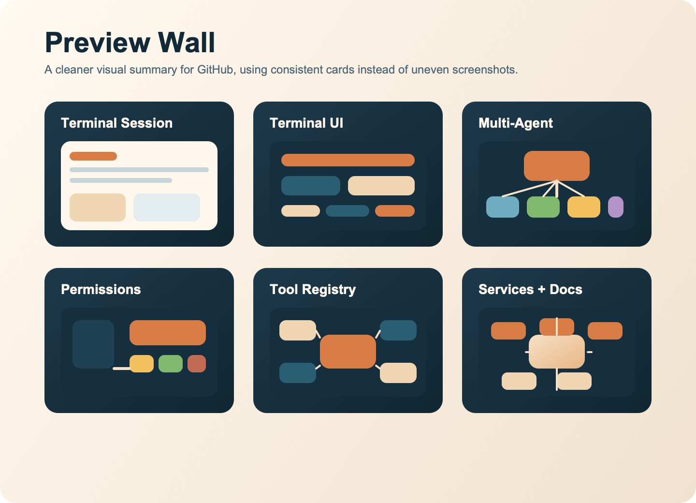

# Claude Code Open

<p align="center">
  <strong>A local-first Claude Code workspace with a full engineering layout, optional recovery entry, and built-in docs assets.</strong>
</p>

<p align="center">
  <a href="./README.md">中文</a> ·
  <a href="./docs/fusion-notes.md">Merge Notes</a> ·
  <a href="./docs/introduction/architecture-overview.mdx">Architecture</a>
</p>

<p align="center">
  
</p>

## Overview

This repository combines the strengths of a runnable local setup and a larger engineering-oriented workspace:

- full `src/`, `packages/`, `scripts/`, and `docs/` layout
- local launcher and recovery mode for fast debugging
- CLI, Ink TUI, tools, commands, MCP, plugins, and Skills support
- refreshed README visuals and screenshot assets for a cleaner GitHub landing page

## Highlights

- full CLI / Ink TUI workflow
- `--print` non-interactive mode
- local launcher via `./bin/claude-local`
- recovery CLI fallback
- configurable API base URL and model mapping
- built-in docs, architecture notes, and runtime screenshots

## Preview

<p align="center">
  
</p>

Full-size reference screenshots are still available in [`docs/runtime-snapshots/`](./docs/runtime-snapshots/), and `docs/fusion-assets/` keeps both PNG display assets and SVG source files.

## Quick Start

Install Bun:

```bash
curl -fsSL https://bun.sh/install | bash
bun --version
```

Install dependencies:

```bash
bun install
```

Create your env file:

```bash
cp .env.example .env
```

Run the full interface:

```bash
bun run dev
```

Run the default CLI path:

```bash
bun run start
```

Run the local launcher:

```bash
./bin/claude-local
```

Recovery mode:

```bash
CLAUDE_CODE_FORCE_RECOVERY_CLI=1 ./bin/claude-local
```

## Structure

```text
bin/                    # local launcher
docs/                   # docs, diagrams, assets
docs/fusion-assets/     # landing SVG artwork
docs/runtime-snapshots/ # runtime screenshots
packages/               # workspace packages
scripts/                # build and maintenance scripts
src/                    # main application code
preload.ts              # local launcher preload
```

## Docs

- [docs/fusion-notes.md](./docs/fusion-notes.md)
- [docs/introduction/architecture-overview.mdx](./docs/introduction/architecture-overview.mdx)
- [docs/conversation/the-loop.mdx](./docs/conversation/the-loop.mdx)
- [docs/tools/what-are-tools.mdx](./docs/tools/what-are-tools.mdx)
- [docs/safety/permission-model.mdx](./docs/safety/permission-model.mdx)
