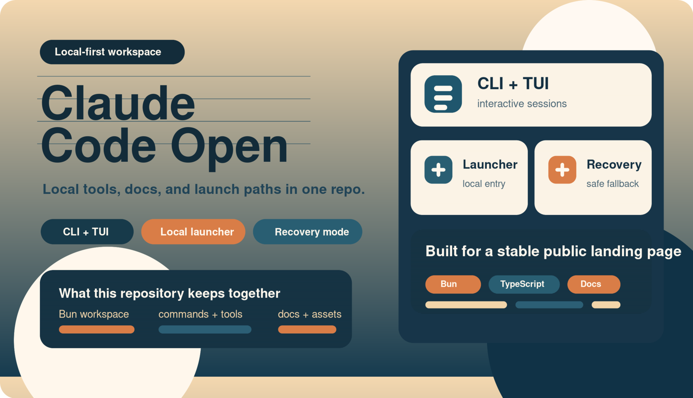
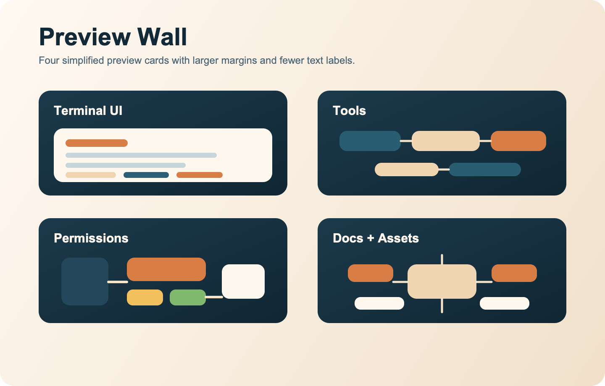

# Claude Code Open

<p align="center">
  <strong>A local-first Claude Code workspace with a full engineering layout, optional recovery entry, and built-in docs assets.</strong>
</p>

<p align="center">
  <a href="./README.md">中文</a> ·
  <a href="./docs/fusion-notes.md">Merge Notes</a> ·
  <a href="./docs/introduction/architecture-overview.mdx">Architecture</a>
</p>

<p align="center">
  
</p>

## Overview

This repository combines a runnable local setup with a larger engineering-oriented workspace:

- full `src/`, `packages/`, `scripts/`, and `docs/` layout
- local launcher and recovery mode for fast debugging
- CLI, Ink TUI, tools, commands, MCP, plugins, and Skills support
- built-in docs assets and architecture notes for public documentation

## Highlights

- full CLI / Ink TUI workflow
- `--print` non-interactive mode
- local launcher via `./bin/claude-local`
- recovery CLI fallback
- configurable API base URL and model mapping
- MCP, plugins, Skills, and commands support

## Preview

<p align="center">
  
</p>

Full-size screenshots are kept in [`docs/runtime-snapshots/`](./docs/runtime-snapshots/), while `docs/fusion-assets/` stores the PNG display assets and their SVG source files.

## Quick Start

### 1. Install Bun

```bash
curl -fsSL https://bun.sh/install | bash
bun --version
```

### 2. Install dependencies

```bash
bun install
```

### 3. Create your env file

```bash
cp .env.example .env
```

Recommended local defaults:

```env
ANTHROPIC_BASE_URL=https://api.example.com/anthropic
ANTHROPIC_API_KEY=sk-your-api-key
ANTHROPIC_AUTH_TOKEN=
ANTHROPIC_MODEL=your-default-model
ANTHROPIC_DEFAULT_SONNET_MODEL=your-default-model
ANTHROPIC_DEFAULT_HAIKU_MODEL=your-default-model
API_TIMEOUT_MS=3000000
CLAUDE_CODE_DISABLE_NONESSENTIAL_TRAFFIC=1
DISABLE_TELEMETRY=1
```

## API and Privacy

The current defaults are reasonably safe for local use:

- API credentials are read from environment variables such as `ANTHROPIC_API_KEY` and `ANTHROPIC_AUTH_TOKEN`, not hardcoded in source files.
- `.env` is ignored by Git, so local secrets are not meant to be committed.
- `.env.example` already defaults to `DISABLE_TELEMETRY=1` and `CLAUDE_CODE_DISABLE_NONESSENTIAL_TRAFFIC=1`.
- third-party telemetry is opt-in. It is only enabled when `CLAUDE_CODE_ENABLE_TELEMETRY=1` is explicitly set.
- privacy level checks in `src/utils/privacyLevel.ts` gate telemetry and non-essential traffic paths.
- auth helpers in `src/utils/auth.ts` and `src/localRecoveryCli.ts` read credentials from env vars and fail early when they are missing.

Recommended practice:

- keep real keys only in your local `.env`
- do not commit `.env`, screenshots, logs, or copied terminal output that may include secrets
- keep `DISABLE_TELEMETRY=1` and `CLAUDE_CODE_DISABLE_NONESSENTIAL_TRAFFIC=1` enabled unless you explicitly need otherwise
- prefer a custom proxy or compatible endpoint through `ANTHROPIC_BASE_URL` instead of editing source code

## Usage Modes

Full TUI:

```bash
bun run dev
```

Default CLI path:

```bash
bun run start
```

Local launcher:

```bash
./bin/claude-local
```

One-shot print mode:

```bash
./bin/claude-local -p "explain this repository"
```

Recovery mode:

```bash
CLAUDE_CODE_FORCE_RECOVERY_CLI=1 ./bin/claude-local
```

## Common Commands

```bash
bun run dev
bun run start
bun run build
bun run health
./bin/claude-local --help
CLAUDE_CODE_FORCE_RECOVERY_CLI=1 ./bin/claude-local --help
```

## Structure

```text
bin/                    # local launcher
docs/                   # docs, diagrams, and landing assets
docs/fusion-assets/     # homepage images and SVG sources
docs/runtime-snapshots/ # runtime screenshots
packages/               # workspace packages
scripts/                # build and maintenance scripts
src/                    # main application code
preload.ts              # local launcher preload
```

## Docs

- [docs/fusion-notes.md](./docs/fusion-notes.md)
- [docs/introduction/architecture-overview.mdx](./docs/introduction/architecture-overview.mdx)
- [docs/conversation/the-loop.mdx](./docs/conversation/the-loop.mdx)
- [docs/tools/what-are-tools.mdx](./docs/tools/what-are-tools.mdx)
- [docs/safety/permission-model.mdx](./docs/safety/permission-model.mdx)
