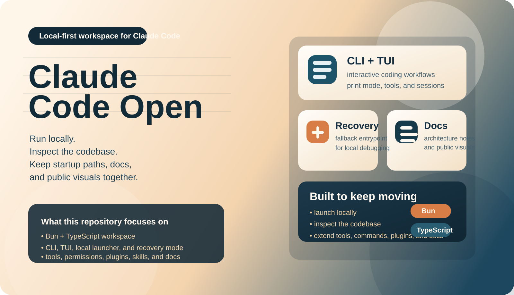
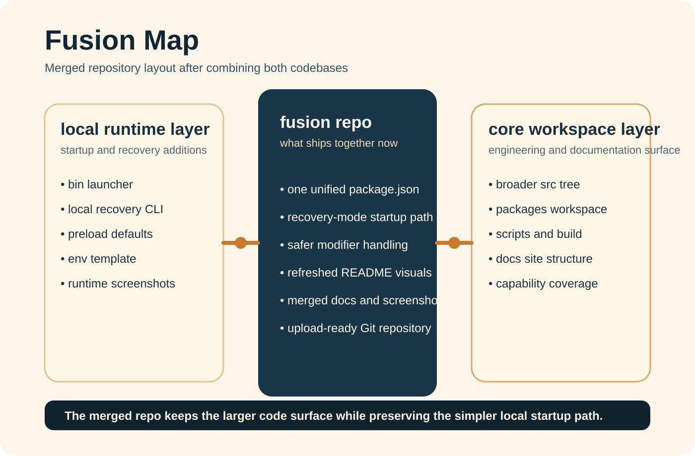
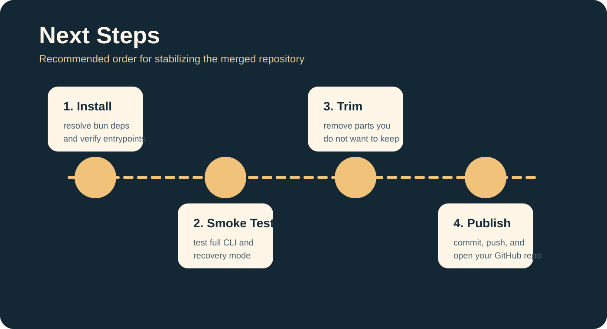

# Claude Code Fusion

<p align="right"><strong>中文</strong> | <a href="./README.en.md">English</a></p>



这个仓库是一个统一整理后的 Claude Code 工作区，已经把核心工程结构、本地启动入口和新的仓库视觉资源整合到同一套目录中。当前策略是：

- 默认开发、构建和主 CLI 行为保持统一主链路
- 保留一个可选的本地启动与恢复入口，方便快速调试
- 重写首页视觉，使用全新的 SVG 图片资源作为仓库展示图

详细融合边界见：[docs/fusion-notes.md](docs/fusion-notes.md)

## 这次融合了什么



代码层：

- 整合了完整的 `src/`、`packages/`、`scripts/`、`docs/` 工程体系
- 保留 `bin/claude-local`、`src/localRecoveryCli.ts`、`preload.ts`、`.env.example` 作为本地启动附加层
- 默认开发入口仍然走 `bun run dev`
- 合入修饰键检测的容错修复

资源层：

- 保留文档站结构
- 补充运行截图到 [`docs/runtime-snapshots/`](docs/runtime-snapshots)
- 新增全新的融合版 SVG 视觉资源到 [`docs/fusion-assets/`](docs/fusion-assets)

## 快速开始

### 1. 安装依赖

```bash
bun install
```

### 2. 配置环境变量

```bash
cp .env.example .env
```

### 3. 运行

完整 CLI：

```bash
bun run dev
```

默认启动脚本：

```bash
bun run start
```

可选的本地启动脚本：

```bash
./bin/claude-local
```

恢复模式：

```bash
CLAUDE_CODE_FORCE_RECOVERY_CLI=1 ./bin/claude-local
```

## 目录重点

```text
bin/                    # 本地运行入口
docs/                   # 文档与展示资源
docs/fusion-assets/     # 新重置的融合视觉图
docs/runtime-snapshots/ # 运行截图
packages/               # workspace 内部包
scripts/                # 工程脚本
src/                    # 主代码区
preload.ts              # 仅供本地附加启动脚本使用
```

## 融合说明

这不是“谁覆盖谁”的简单拷贝，而是按下面的原则处理：

1. 主 CLI、构建和文档链路保持统一
2. 本地启动与恢复能力作为附加层保留
3. 仓库门面和图片重新设计，避免首页继续沿用旧图

## 图片

新的首页图：

- [hero-fusion.svg](docs/fusion-assets/hero-fusion.svg)
- [feature-map.svg](docs/fusion-assets/feature-map.svg)
- [roadmap.svg](docs/fusion-assets/roadmap.svg)

补充的运行截图：

- [00runtime.png](docs/runtime-snapshots/00runtime.png)
- [01-overall-architecture.png](docs/runtime-snapshots/01-overall-architecture.png)
- [02-request-lifecycle.png](docs/runtime-snapshots/02-request-lifecycle.png)
- [03-tool-system.png](docs/runtime-snapshots/03-tool-system.png)
- [04-multi-agent.png](docs/runtime-snapshots/04-multi-agent.png)
- [05-terminal-ui.png](docs/runtime-snapshots/05-terminal-ui.png)
- [06-permission-security.png](docs/runtime-snapshots/06-permission-security.png)
- [07-services-layer.png](docs/runtime-snapshots/07-services-layer.png)
- [08-state-data-flow.png](docs/runtime-snapshots/08-state-data-flow.png)


