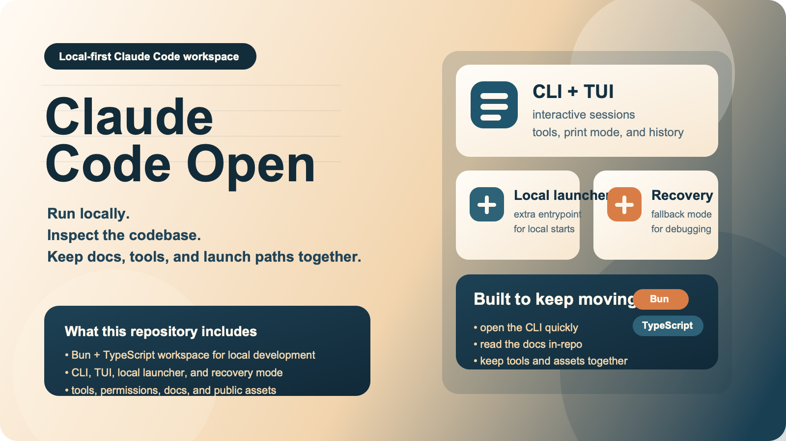
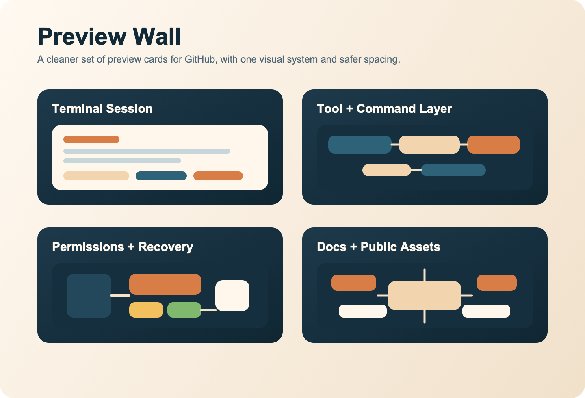
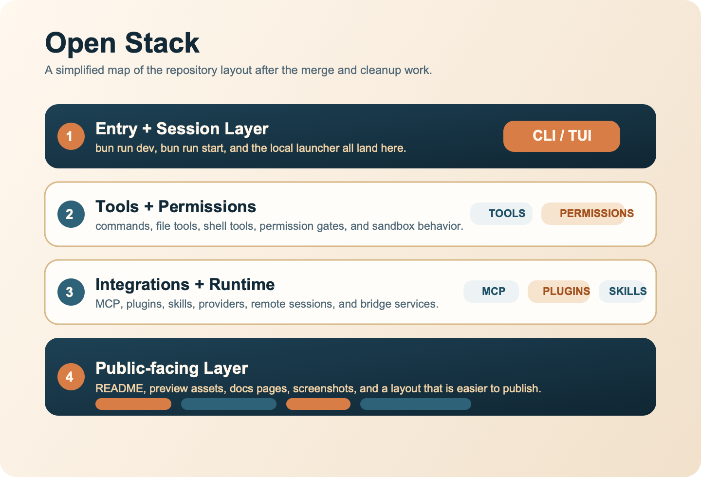
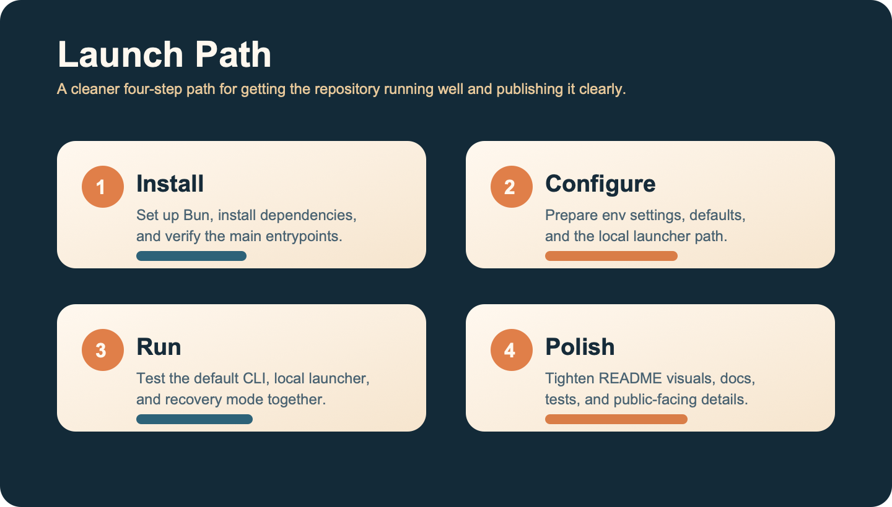

# Claude Code Open

<p align="center">
  <strong>一个可本地运行、可继续开发、带完整工程结构与文档资源的 Claude Code 工作区。</strong>
</p>

<p align="center">
  <a href="./README.en.md">English</a> ·
  <a href="./docs/fusion-notes.md">融合说明</a> ·
  <a href="./docs/introduction/architecture-overview.mdx">架构概览</a>
</p>

<p align="center">
  
</p>

## 项目定位

这个仓库不是只做一个能启动的壳子，也不是只保留文档站结构，而是把两种路线的优点整合到了一起：

- 保留完整的 `src/`、`packages/`、`scripts/`、`docs/` 工程布局
- 保留面向本地使用的启动入口、恢复模式和环境模板
- 保留终端交互、命令系统、工具系统、MCP、插件与 Skills 能力
- 重做仓库门面图片与首页编排，让 GitHub 首页更适合直接公开展示

## 你可以得到什么

- 完整 CLI / Ink TUI 交互界面
- `--print` 非交互输出模式
- 本地启动脚本 `./bin/claude-local`
- Recovery CLI 降级模式
- 自定义 API 端点与模型配置
- MCP / 插件 / Skills / 命令系统
- 文档目录、架构图、运行截图和工程脚本

## 界面预览

<p align="center">
  
</p>

完整运行截图保留在 [`docs/runtime-snapshots/`](./docs/runtime-snapshots/) 目录里，README 首页只展示统一风格的预览板，避免 GitHub 上出现比例和视觉重量不一致的问题。`docs/fusion-assets/` 同时保留了 PNG 展示图和 SVG 源文件。

## 架构与能力

<p align="center">
  
</p>

这套仓库现在更接近“可继续维护的工程版 + 好上手的本地版”组合：

- 默认主链路走 `bun run dev` / `bun run start`
- 本地附加入口走 `./bin/claude-local`
- 出现启动或界面问题时，可直接切换到 Recovery CLI
- 文档与截图资源保留在仓库内，便于后续继续整理公开页面

## 快速开始

### 1. 安装 Bun

```bash
curl -fsSL https://bun.sh/install | bash
bun --version
```

### 2. 安装依赖

```bash
bun install
```

### 3. 配置环境变量

```bash
cp .env.example .env
```

常用变量：

```env
ANTHROPIC_API_KEY=sk-xxx
ANTHROPIC_BASE_URL=https://api.anthropic.com
ANTHROPIC_MODEL=claude-sonnet-4-5
ANTHROPIC_DEFAULT_SONNET_MODEL=claude-sonnet-4-5
ANTHROPIC_DEFAULT_HAIKU_MODEL=claude-3-5-haiku-latest
API_TIMEOUT_MS=600000
DISABLE_TELEMETRY=1
CLAUDE_CODE_DISABLE_NONESSENTIAL_TRAFFIC=1
```

### 4. 启动

完整 TUI：

```bash
bun run dev
```

默认 CLI 入口：

```bash
bun run start
```

本地附加入口：

```bash
./bin/claude-local
```

单次输出模式：

```bash
./bin/claude-local -p "explain this repository"
```

恢复模式：

```bash
CLAUDE_CODE_FORCE_RECOVERY_CLI=1 ./bin/claude-local
```

## 常用命令

```bash
bun run dev
bun run start
bun run build
bun run health
./bin/claude-local --help
CLAUDE_CODE_FORCE_RECOVERY_CLI=1 ./bin/claude-local --help
```

## 目录结构

```text
bin/                    # 本地启动入口
docs/                   # 文档、架构说明、图片资源
docs/fusion-assets/     # 首页图片与 SVG 源文件
docs/runtime-snapshots/ # 运行截图
packages/               # workspace 内部包
scripts/                # 构建与维护脚本
src/                    # 主代码区
preload.ts              # 本地启动预加载
```

## 推荐阅读

- [docs/fusion-notes.md](./docs/fusion-notes.md)
- [docs/introduction/architecture-overview.mdx](./docs/introduction/architecture-overview.mdx)
- [docs/conversation/the-loop.mdx](./docs/conversation/the-loop.mdx)
- [docs/tools/what-are-tools.mdx](./docs/tools/what-are-tools.mdx)
- [docs/safety/permission-model.mdx](./docs/safety/permission-model.mdx)

## 路线图

<p align="center">
  
</p>

后续更适合继续推进这些方向：

- 继续清理公开仓库门面与说明文案
- 继续吸收稳定性修复并补更多验证
- 继续整理 docs 站点内容与结构
- 继续优化本地启动、恢复模式与跨平台体验
